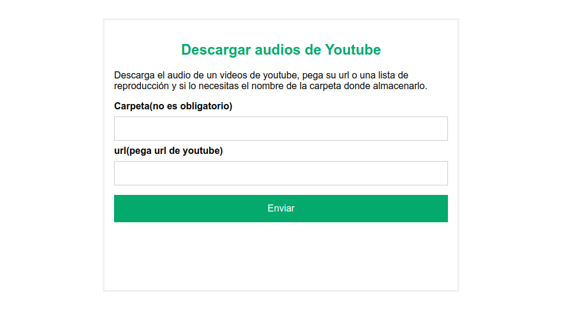

# TEXTO TO MP3

Se trata de sencilla aplicación de entorno servidor con interface web que nos permite descargar de youtube en formato audio.
Esta pensada para instalar en un rapsberry y poder disfrutar de servicio en casa. Esta probada en una Rasperry pi 4

pega la url del video o de la lista de reproducción, introduce un nombre de carpeta si necesitas que se agrupen y descargará,
el audio del video.



Para correr la aplicación 

**crear primero la carpeta de almacenamiento de resultados**

    mkdir youtube_audios

### con docker

de forma sencilla

    docker run --rm -v $PWD/youtube_audios:/youtube_audios -p 80:80 manologcode/yt_dlp 

y corre en nuestro navegador http://localhost

podemos asignarle puertos y nombres cuando convivan con otros contenedores.

```

docker run --rm \
--name=text_audios \
--restart unless-stopped \
-p 5000:80 \
-v $PWD/youtube_audios:/youtube_audios \
manologcode/yt_dlp 

```

### con docker compose

```

services:
  yt_dlp:
    image: manologcode/yt_dlp
    restart: always
    container_name: yt_dlp
    command: /usr/local/bin/gunicorn wsgi:app  -w 5 -b :5000 --reload
    ports:
      - "5000:5000"
    volumes:
      - ./youtube_audios:/youtube_audios

```

Si la corremos en nuestro ordenador una vez arrancado el servido http://localhost:5000 los archivos generados aparecen en la carpeta **youtube_audios.**