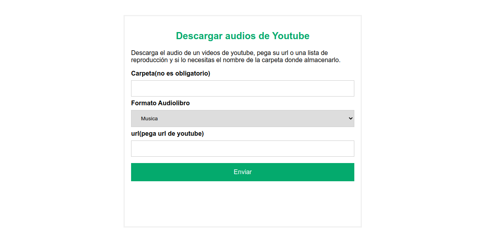

# DESCARGA AUDIO YOUTUBE

Se trata de sencilla aplicación de entorno servidor con interface web que nos permite descargar de Youtube en formato audio.
Esta pensada para instalar en un Raspberry y poder disfrutar de servicio en casa. Esta probada en una Raspberry pi 4.
actualizada la imagen a 2023-02-22

Pega la url del video o de la lista de reproducción, introduce un nombre de carpeta si necesitas que se agrupen y descargará, el audio del video.



Se le ha añadido alguna modificaciones para adaptarlo a mis necesidades, un selector de música o audiolibro, la diferencia es en la carpeta que los almacena y el los metadatos de album, están adaptados para gestionar los archivos de música con Navidrome y los archivos de audiobooks con Audiobooksself.

Para correr la aplicación 

**crear primero las carpetas de almacenamiento de resultados**

    mkdir -p youtube_audios/musics
    mkdir -p youtube_audios/audiobooks


### con docker

de forma sencilla

    docker run --rm -v $PWD/youtube_audios:/youtube_audios -p 80:80 manologcode/yt_dlp 

y corre en nuestro navegador http://localhost

podemos asignarle puertos y nombres cuando convivan con otros contenedores.

```

docker run --rm \
--name=text_audios \
--restart unless-stopped \
-p 5000:80 \
-v $PWD/youtube_audios:/youtube_audios \
manologcode/yt_dlp 

```

### con docker compose

```

services:
  yt_dlp:
    image: manologcode/yt_dlp
    restart: always
    container_name: yt_dlp
    command: /usr/local/bin/gunicorn wsgi:app  -w 5 -b :5000 --reload
    ports:
      - "5000:5000"
    volumes:
      - ./youtube_audios:/youtube_audios

```

Si la corremos en nuestro ordenador una vez arrancado el servido http://localhost:5000 los archivos generados aparecen en la carpeta **youtube_audios.**